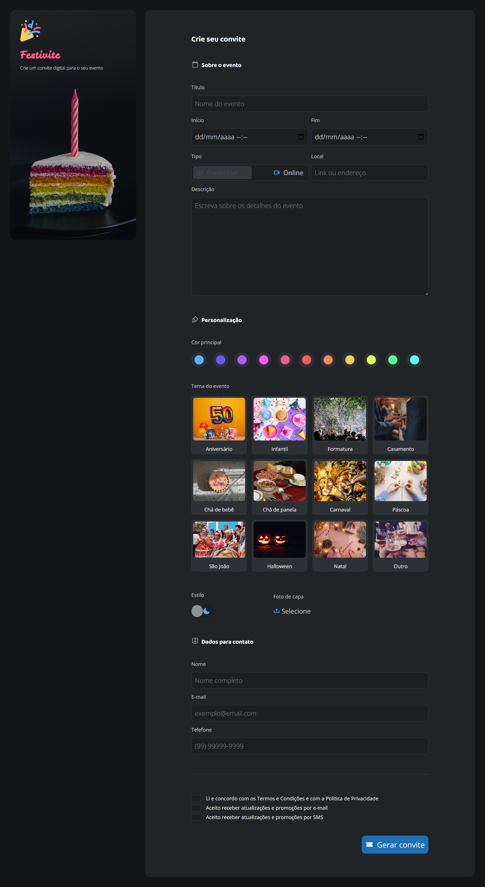
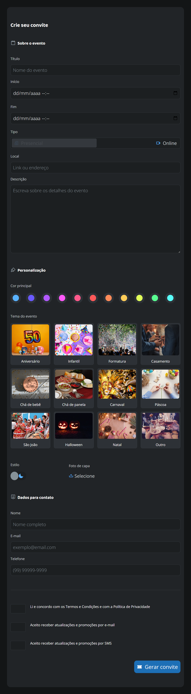
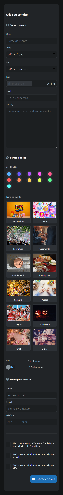

<h1 align="center">Desafio Festivite</h1>

Projeto de desafio do curso Fullstack da Rocketseat. O projeto está presente no módulo <em>Avançando no HTML e CSS</em>. A versão original do projeto não propõe o uso de javascript, mas resolvi adicionar algumas coisas diferentes, como um light e dark mode.

<h2>Projeto em funcionamento</h2>

<h2>Imagens do projeto</h2>

<em>Versões desktop, tablet e mobile</em>

